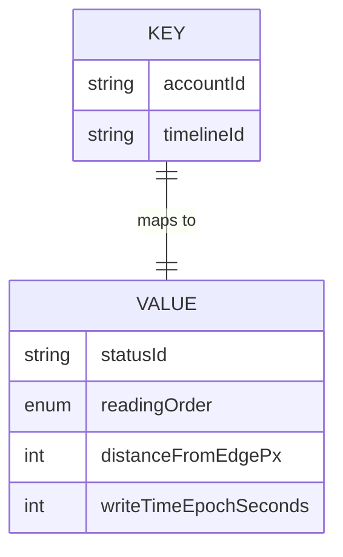

# RFC: Saving the user's reading position

Status: First draft, looking for feedback, edge cases, alternative ideas

# Goal

Accurately restore the position of the oldest item we can be comfortable the user has not definitively read when they return to a timeline.

> Note: This applies to statuses and notifications. Where I've written "status" below assume it covers notifications as well.

If in doubt, err on the side of restoring a reading position that shows statuses the user has already read (and perhaps some they have not) rather than potentially restoring a reading position that moves some statuses they have not read off-screen and away from their preferred reading position.

I.e., if the user is reading "oldest first" they should never have to scroll back down to see a status they have not seen. And if they are reading "newest first" they should not have to scroll up to see a status they have not seen.

# Complications

## Device orientation

The device orientation could change. Consider:

1. User is reading their home timeline in portrait orientation
2. User switches to the notification timeline
3. User reorients device to landscape
4. User switches back to the home timeline

When this happens some statuses that were previously visible may be pushed off screen, and vice-versa.

## Reading order

The "oldest item we can be comfortable the user has not definitively read" depends on the user's preferred reading order.

"Oldest first" implies they are scrolling up. "Newest first" implies they are scrolling down. This might change at runtime.

1. User is reading their home timeline "oldest first"
2. User switches to the notification timeline
3. User changes their reading order preference to "newest first"
4. User switches back to the home timeline

## The saved status might be missing

The status the user was reading may no longer be present, for reasons including:

- The original author may have deleted it
- The user may have muted or blocked that user
- The user may have muted or blocked hashtags mentioned in the post
- The user may have muted or blocked the domain
- The user may have changed their notification filters
- The user may not have used Tusky for some time, and the status has now dropped out of their timeline

# Proposed solution

## Reading position structure

To meet the goals, the stored reading position is a map:

In the key, `timelineId` is a unique identifier for the relevant timeline, one of:

| Type                  | Identifier                      |
|-----------------------|---------------------------------|
| Home timeline         | `"HOME"`                        |
| Notification timeline | `"NOTIFICATIONS"`               |
| Local (per server)    | `"LOCAL:{serverDomain}"`        |
| Federated timeline    | `"FEDERATED"`                   |
| Direct messages       | `"CONVERSATIONS"`               |
| Favourites            | `"FAVOURITES"`                  |
| Bookmarks             | `"BOOKMARKS"`                   |
| User defined list     | `LIST:{listId}`                 |
| Hashtag               | `"HASHTAG:{tag,tag,tag,...}"`   |
| Account               | `"ACCOUNT:{accountId}"`         |
| Account with replies  | `"ACCOUNT:REPLIES:{accountId}"` |
| Account               | `"ACCOUNT:PINNED:{accountId}"`  |
| Thread                | `"THREAD:{statusId}"`           |

> The `{` and `}` are not part of the identifier.

> The exact format of the identifiers is a little speculative, and depends on how they are stored. For example, if these were stored in `SharedPreferences` then a string representation like this makes sense. If these are stored in the database then perhaps these are separate columns instead?

For lists, `listId` is the list's ID from the Mastodon API.

The local timeline is treated as per-server because although Tusky does not yet support following the local timelines of different servers, I plan on adding that as a feature in the future.

"Account" is the user viewing the timeline from an account (i.e., from the Account Profile screen). This might be their account, or someone else's.

"Hashtag" is the user viewing a composed timeline of posts containing one or more of the relevant hashtags. The hashtags are listed in the identifier, in sorted order.

"Thread" is the user viewing a thread of replies, where the thread is focused on the status given by `statusId`.

The value tuple is:

- `statusId` - the identifier of the relevant status (or notification) which will have its position restored.
- `readingOrder` - the user's reading order at the time the position was saved (not necessarily their current order).
- `distanceFromEdgePx` - the status' distance from the relevant list view edge, in pixels. If the reading order is "oldest first" this is the distance from the status' bottom edge to the bottom of the list it is in. If the reading order is "newest first" this is the distance from the status' top edge to the top of the list it is in.
- `writeTimeEpochSeconds` - when this position was most recently saved, in Unix epoch seconds (see "Pruning reading positions" later for why).

## Choosing which status' position to save

The status to save depends on the user's reading order at the time the position is saved.

> Important: **Not** the reading order at the time the position is restored.

If the user is scrolling up ("oldest first") this is the bottom-most visible status. The user might be scrolling slowly, an item at a time. But they might also be scrolling a screen's worth of information at a time. So the only status we can be certain they haven't read yet is the bottom-most fully visible status.

If the user is scrolling down ("newest first") the same applies, but now the top-most visible status is the one to restore.

From the `RecylerView` layout manager this is `findFirstCompletelyVisibleItemPosition()` and `findLastCompletelyVisibleItemPosition()`.

To preserve full restoration fidelity the item's distance from the relevant edge should also be recorded.

> https://medium.com/@rituel521/improving-accuracy-of-computeverticalscrolloffset-for-linearlayoutmanager-38699a9d03b suggests that this might need a small amount of custom layout manager code to do accurately.

## Save the current position, not the high-water mark

The position to save is always the current position, **not** the user's furthest position in the list.

I.e,. if the user is reading oldest-first, scrolls up some pages, and then scrolls back down before leaving the timeline, save their last position, not the furthest position they had read in the timeline.

## Restoring the reading position

When opening a list the app should check to see if a saved reading position exists, and restore it.

If the saved status is missing the app should pick another status based on the user's reading order.

If the user is reading "oldest first" it should choose the next oldest status.

If the user is reading "newest first" it should choose the next newest status.

If these do not exist (e.g., the user's saved position was at the start or end of the timeline) then choose the oldest status (if reading oldest first) or the newest status if reading newest first.

## Pruning reading positions

As specified, the list of timeline identifiers can grow without bounds.
To prevent that, each reading position should also have a modification time.

> If reading positions are stored in an SQLite database then this can be maintained automatically with an update trigger.

A worker process can periodically groom the list of timeline identifiers and remove those that haven't been modified in some time. 28 days is probably a reasonable amount of time to retain stale identifiers.

## Mastodon Marker API

Mastodon provides an API to save the user's reading position in a timeline (https://docs.joinmastodon.org/methods/markers/).

This is of limited use.

1. It only works with the `home` and `notifications` timelines.
2. It saves the status, but nothing about reading order or distance from the edge

I suggest that we treat this as a write-only API. Tusky can save the user's reading position in the `home` or `notifications` timelines, but will not restore from it.

This is because:

1. I suspect that user's using both Tusky and other clients that support the API are a small fraction of the user base
2. It is more predictable for users if they open Tusky and it restores as it was when they left it
3. It is more predictable for users if all Tusky timelines behave the same way, without special treatment for `home` and `notifications`.
