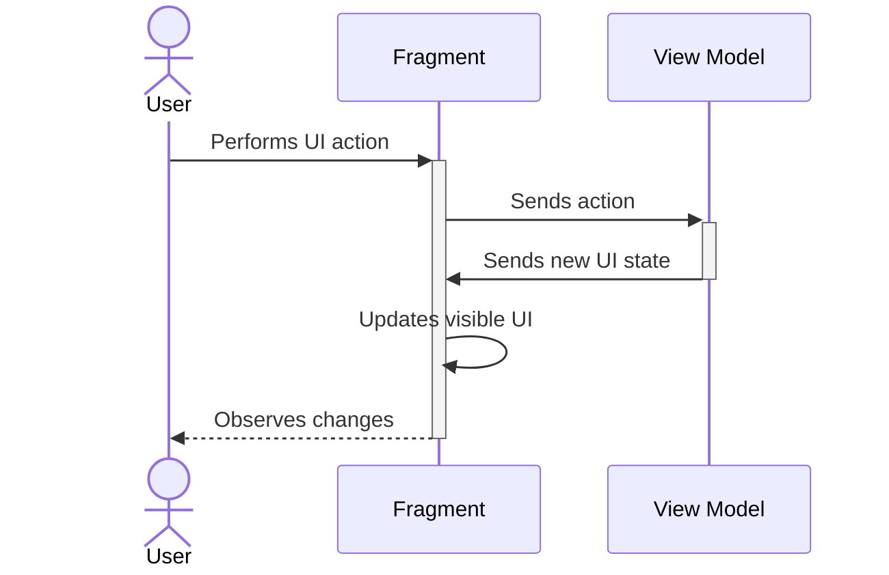
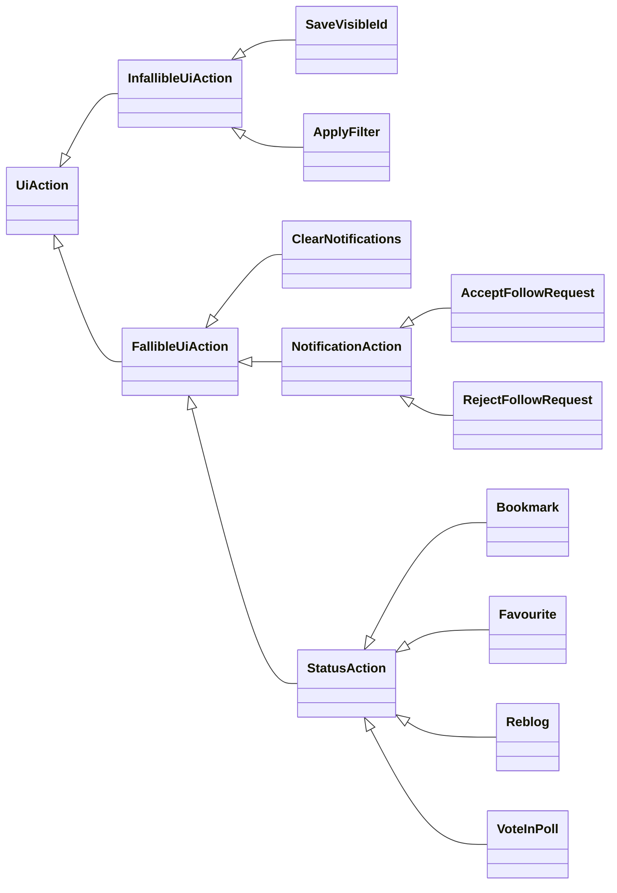
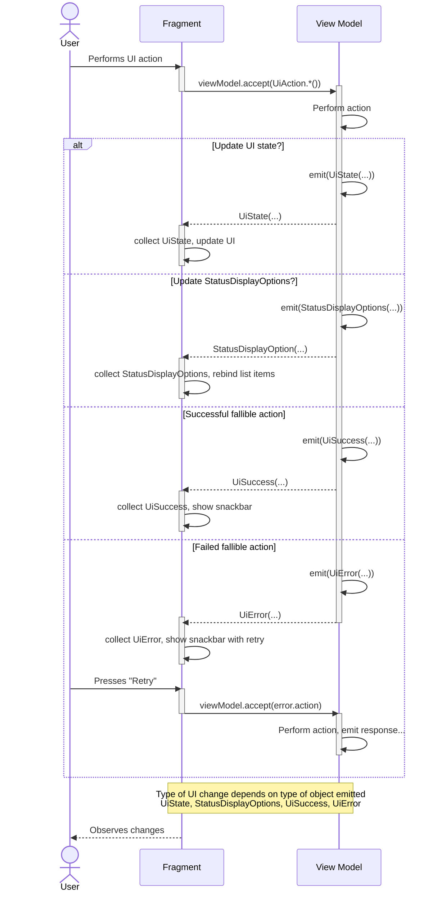

# View model interface

## Synopsis

This document explains how data flows between the view model and the UI it
is serving (either an `Activity` or `Fragment`).

> Note: At the time of writing this is correct for `NotificationsViewModel`
> and `NotificationsFragment`. Other components will be updated over time.

After reading this document you should understand:

- How user actions in the UI are communicated to the view model
- How changes in the view model are communicated to the UI

Before reading this document you should:

- Understand Kotlin flows
- Read [Guide to app architecture / UI layer](https://developer.android.com/topic/architecture/ui-layer)

## Action and UiState flows

### The basics

Every action between the user and application can be reduced to the following:



In this model, actions always flow from left to right. The user tells
the fragment to do something, then te fragment tells the view model to do
something.

The view model does **not** tell the fragment to do something.

State always flows from right to left. The view model tells the fragment
"Here's the new state, it's up to you how to display it."

Not shown on this diagram, but implicit, is these actions are asynchronous,
and the view model may be making one or more requests to other components to
gather the data to use for the new UI state.

Rather than modelling this transfer of data as function calls, and by passing
callback functions from place to place they can be modelled as Kotlin flows
between the Fragment and View Model.

For example:

1. The View Model creates two flows and exposes them to the Fragment.

```kotlin
// In the View Model
data class UiAction(val action: String) { ... }

data class UiState(...) { ... }

val actionFlow = MutableSharedFlow<UiAction>()
val uiStateFlow = StateFlow<UiState>()

init {
    // ...

    viewModelScope.launch {
        actionFlow
            .collect {
                // Do work
                // ... work is complete

                // Update UI state
                uiStateFlow.emit(uiStatFlow.value.update { ... })
            }
    }

    // ...
}
```

2. The fragment collects from `uiStateFlow`, and updates the visible UI,
and emits new `UiAction` objects in to `actionFlow` in response to the
user interacting with the UI.

```kotlin
// In the Fragment
fun onViewCreated(...) {
    // ...

    binding.button.setOnClickListener {
        // Won't work, see section "Accepting user actions from the UI" for why
        viewModel.actionFlow.emit(UiAction(action = "buttonClick"))
    }

    lifecycleScope.launch {
        viewModel.uiStateFlow.collectLatest { uiState ->
            updateUiWithState(uiState)
        }
    }

    // ...
}
```

This is a good start, but it can be improved.

### Model actions with sealed classes

The prototypical example in the previous section suggested the
`UiAction` could be modelled as

```kotlin
data class UiAction(val action: String) { ... }
```

This is not great.

- It's stringly-typed, with opportunity for run time errors
- Trying to store all possible UI actions in a single type will lead
  to a plethora of different properties, only some of which are valid
  for a given action.

These problems can be solved by making `UiAction` a sealed class, and
defining subclasses, one per action.

In the case of `NotificationsFragment` the actions the user can take in
the UI are:

- Apply a filter to the set of notifications
- Clear the current set of notifications
- Save the ID of the currently visible notification in the list

> NOTE: The user can also interact with items in the list of the
> notifications.
>
> That is handled a little differently because of how code outside
> `NotificationsFragment` is currently written. It will be adjusted at
> a later time.

That becomes:

```kotlin
// In the View Model
sealed class UiAction {
    data class ApplyFilter(val filter: Set<Filter>) : UiAction()
    object ClearNotifications : UiAction()
    data class SaveVisibleId(val visibleId: String) : UiAction()
}
```

This has multiple benefits:

- The actions the view model can perform are defined in a single place
- Each action clearly describes the information it carries with it
- Each action is strongly typed; it is impossible to create an action
  of the wrong type
- As a sealed class, using the `when` statement to process actions gives
  us compile-time guarantees all actions are handled

In addition, the view model can spawn multiple coroutines to process
the different actions, by filtering out actions dependent on their type,
and using other convenience methods on flows. For example:

```kotlin
// In the View Model
val actionFlow = MutableSharedFlow<UiAction>() // As before

init {
    // ...

    handleApplyFilter()
    handleClearNotifications()
    handleSaveVisibleId()

    // ...
}

fun handleApplyFilter() = viewModelScope.launch {
    actionFlow
        .filterIsInstance<UiAction.ApplyFilter>()
        .distinctUntilChanged()
        .collect { action ->
            // Apply the filter, update state
        }
}

fun handleClearNotifications() = viewModelScope.launch {
    actionFlow
        .filterIsInstance<UiAction.ClearNotifications>()
        .distinctUntilChanged()
        .collect { action ->
            // Clear notifications, update state
        }
}

fun handleSaveVisibleId() = viewModelScope.launch {
    actionFlow
        .filterIsInstance<UiAction.SaveVisibleId>()
        .distinctUntilChanged()
        .collect { action ->
            // Save the ID, no need to update state
        }
}
```

Each of those runs in separate coroutines and ignores duplicate events.

### Accepting user actions from the UI

Example code earlier had this snippet, which does not work.

```kotlin
// In the Fragment
binding.button.setOnClickListener {
    // Won't work, see section "Accepting user actions from the UI" for why
    viewModel.actionFlow.emit(UiAction(action = "buttonClick"))
}
```

This fails because `emit()` is a `suspend fun`, so it must be called from a
coroutine scope.

To fix this, provide a function or property in the view model that accepts
`UiAction` and emits them in `actionFlow` under the view model's scope.

```kotlin
// In the View Model
val accept: (UiAction) -> Unit = { action ->
    viewModelScope.launch { actionFlow.emit(action)}
}
```

When the Fragment wants to send a `UiAction` to the view model it can call this
function.

```kotlin
// In the Fragment
binding.button.setOnClickListener {
    viewModel.accept(UiAction.ClearNotifications)
}
```

### Model the difference between fallible and infallible actions

An infallible action either cannot fail, or, can fail but there are no
user-visible changes to the UI.

Conversely, a fallible action can fail and the user should be notified.

I've found it helpful to distinguish between the two at the type level, as
it simplifies error handling in the Fragment.

So the actions in `NotificationFragment` are modelled as:

```kotlin
// In the View Model
sealed class UiAction

sealed class FallibleUiAction : UiAction() {
    // Actions that can fail are modelled here
    // ...
}

sealed class InfallibleUiAction : UiAction() {
    // Actions that cannot fail are modelled here
    // ...
}
```

### Additional `UiAction` subclasses

It can be useful to have a deeper `UiAction` class hierarchy, as filtering
flows by the class of item in the flow is straightforward.

`NotificationsViewModel` splits the fallible actions the user can take as
operating on three different parts of the UI:

- Everything not the list of notifications
- Notifications in the list of notifications
- Statuses in the list of notifications

Those last two are modelled as:

```kotlin
// In the View Model
sealed class NotificationAction : FallibleUiAction() {
    // subclasses here
}

sealed class StatusAction(
    open val statusViewData: StatusViewData
) : FallibleUiAction() {
    // subclasses here
}
```

Separate handling for actions on notifications and statuses is then achieved
with code like:

```kotlin
viewModelScope.launch {
    uiAction.filterIsInstance<NotificationAction>()
        .collect { action ->
            // Process notification actions here
        }
}

viewModelScope.launch {
    uiAction.filterIsInstance<StatusAction>()
        .collect { action ->
            // Process status actions where
        }
}
```

At the time of writing the UI action hierarchy for `NotificationsViewModel`
is:



### Multiple output flows

So far the UI has been modelled as a single output flow of a single `UiState`
type.

For simple UIs that can be sufficient. As the UI gets more complex it
can be helpful to separate these in to different flows.

In some cases the Android framework requires you to do this. For
example, the flow of `PagingData` in to the adapter is provided and
managed by the `PagingData` class. You should not attempt to reassign
it or update it during normal operation.

Similarly, `RecyclerView.Adapter` provides its own `loadStateFlow`, which
communicates information about the loading state of data in to the adapter.

For `NotificationsViewModel` I have found it helpful to provide flows to
separate the following types

- `PagingData` in to the adapter
- `UiState`, representing UI state *outside* the main `RecyclerView`
- `StatusDisplayOptions`, representing the user's preferences for how
  all statuses should be displayed
- `UiSuccess`, representing transient notifications about a
  fallible action succeeding
- `UiError`, representing transient notifications about a fallible action
  failing

There are separated this way to roughly match how the Fragment will want
to process them.

- `PagingData` is handed to the adapter and not modified by the Fragment
- `UiState` is generally updated no matter what has changed.
- `StatusDisplayOptions` is handled by rebinding all visible items in
  the list, without disturbing the rest of the UI
- `UiSuccess` show a brief snackbar without disturbing the rest
  of the UI
- `UiError` show a fixed snackbar with a "Retry" option
  (if the operation can be retried)

They also have different statefulness requirements, which makes separating
them in to different flows a sensible approach.

`PagingData`, `UiState`, and `StatusDisplayOptions` are stateful -- if the
Fragment disconnects from the flow and then reconnects (e.g., because of a
configuration change) the Fragment should receive the most recent state of
each of these. So they are modeled as a `StateFlow`.

`UiSuccess` is not stateful. The success messages are transient; if one has
been shown, and there is a subsequent configuration change the user should
not see the success message again. So this is modeled as a `SharedFlow`.

`UiError` is not stateful, but it must be hot, otherwise error messages can
be lost, so it is implemented as a channel and exposed as a flow.

It may be easier to explain what happens if you do not do this.

Suppose `UiError` is a `SharedFlow`. The view model initialises and performs
some fallible operations, such as loading data from a repository that involves
a network request.

This operation fails, so an error is sent to `uiError`. However, the
fragment or activity has not yet started collecting from that flow. So as a
`SharedFlow` the error is lost and not displayed to the user.

If `UiError` was implemented as a `StateFlow` this problem would not occur.
However, the flow would need an initial value (an empty `StateFlow` is not
possible) and there would need to be a mechanism to dismiss errors from the
state.

Instead, the error flow is backed by a private channel and exposed as a flow.
If an error is sent by the view model before the UI has collected from the
flow the error will be persisted. And once the error has been collected it
will not persist in the channel.

The implementation looks like this:

```kotlin
private val _uiErrorChannel = Channel<UiError>()
val uiError = _uiErrorChannel.receiveAsFlow()

// Later, to send an error
_uiErrorChannel.send(UiError.SomeError(/* ... */))
```

### Modelling success and failure for fallible actions

A fallible action should have models capturing success and failure
information, and be communicated to the UI.

> Note: Infallible actions, by definition, neither succeed or fail, so
> there is no need to model those states for them.

Suppose the user has clicked on the "bookmark" button on a status,
sending a `UiAction.FallibleAction.StatusAction.Bookmark(...)` to the
view model.

The view model processes the action, and is successful.

To signal this back to the UI it emits a `UiSuccess` subclass for the action's
type in to the `uiSuccess` flow, and includes the original action request.

You can read this as the `action` in the `UiAction` is a message from the
Fragment saying "Here is the action I want to be performed" and the `action`
in `UiSuccess` is the View Model saying "Here is the action that was carried
out."

Including the original action in the successful response allows the UI to be
updated in response to the success.

Unsurprisingly, this is modelled with a `UiSuccess` class, and per-action
subclasses.

This shows typical code for a success class, in this case, bookmarking a
status has succeeded.

```kotlin
sealed class StatusActionSuccess(open val action: StatusAction) : UiSuccess () {
    data class Bookmark(override val action: StatusAction.Bookmark) :
        StatusActionSuccess(action)

    // ... other action successes here

    companion object {
        fun from (action: StatusAction) = when (action) {
            is StatusAction.Bookmark -> Bookmark(action)
            // ... other actions here
        }
    }
}
```

Failures are modelled similarly, with a `UiError` class. However, details
about the error are included, as well as the original action.

```kotlin
sealed class UiError(
    open val throwable: Throwable,
    @StringRes val message: Int,
    open val action: UiAction? = null
) {
    data class Bookmark(
      override val throwable: Throwable,
      override val action: StatusAction.Bookmark
    ) : UiError(throwable, R.string.ui_error_bookmark, action)

    // ... other action errors here

    companion object {
        fun make(throwable: Throwable, action: FallibleUiAction) = when (action) {
            is StatusAction.Bookmark -> Bookmark(throwable, action)
            // other actions here
      }
    }
}
```

So each fallible action has three associated classes; one for the action,
one to represent the action succeeding, and one to represent the action
failing.

For the single "bookmark a status" action the code for its three classes
looks like this:

```kotlin
// In the View Model
sealed class StatusAction(
    open val statusViewData: StatusViewData
) : FallibleUiAction() {
    data class Bookmark(
        val state: Boolean,
        override val statusViewData: StatusViewData
    ) : StatusAction(statusViewData)

    // ... other actions here
}

sealed class StatusActionSuccess(open val action: StatusAction) : UiSuccess () {
    data class Bookmark(override val action: StatusAction.Bookmark) :
        StatusActionSuccess(action)

    // ... other action successes here

    companion object {
        fun from (action: StatusAction) = when (action) {
            is StatusAction.Bookmark -> Bookmark(action)
            // ... other actions here
        }
    }
}

sealed class UiError(
    open val throwable: Throwable,
    @StringRes val message: Int,
    open val action: UiAction? = null
) {
    data class Bookmark(
        override val throwable: Throwable,
        override val action: StatusAction.Bookmark
    ) : UiError(throwable, R.string.ui_error_bookmark, action)

    // ... other action errors here

    companion object {
        fun make(throwable: Throwable, action: FallibleUiAction) = when (action) {
            is StatusAction.Bookmark -> Bookmark(throwable, action)
            // other actions here
        }
    }
}
```

> Note: I haven't found it necessary to create subclasses for `UiError`, as
> all fallible errors (so far) are handled identically. This may change in
> the future.

Receiving status actions in the view model (from the `uiAction` flow) is then:

```kotlin
// In the View Model
viewModelScope.launch {
    uiAction.filterIsInstance<StatusAction>()
      .collect { action ->
          try {
              when (action) {
                  is StatusAction.Bookmark -> {
                     // Process the request
                  }
                  // Other action types handled here
              }
              uiSuccess.emit(StatusActionSuccess.from(action))
          } catch (e: Exception) {
              uiError.emit(UiError.make(e, action))
          }
      }
}
```

Basic success handling in the fragment would be:

```kotlin
// In the Fragment
lifecycleScope.launch {
    // Show a generic message when an action succeeds
    this.launch {
        viewModel.uiSuccess.collect {
            Snackbar.make(binding.root, "Success!", LENGTH_SHORT).show()
        }
    }
}
```

In practice it is more complicated, with different actions depending on the
type of success.

Basic error handling in the fragment would be:

```kotlin
lifecycleScope.launch {
    // Show a specific error when an action fails
    this.launch {
        viewModel.uiError.collect { error ->
            SnackBar.make(
                binding.root,
                getString(error.message),
                LENGTH_LONG
            ).show()
        }
    }
}
```

### Supporting "retry" semantics

Including the original action in the `UiError` response means implementing a
"retry" function is as simple as re-sending the original action (included in
the error) back to the view model.

The previous code can be amended like so:

```kotlin
lifecycleScope.launch {
    // Show a specific error when an action fails. Provide a "Retry" option
    // on the snackbar, and re-send the original action to retry.
    this.launch {
        viewModel.uiError.collect { error ->
            val snackbar = SnackBar.make(
                binding.root,
                getString(error.message),
                LENGTH_LONG
            )
            // New code here -- add a button to the snackbar to retry
            // the operation by resending the action that failed.
            error.action?.let { action ->
                snackbar.setAction("Retry") { viewModel.accept(action) }
            }
            snackbar.show()
        }
    }
}
```

### Updated sequence diagram


